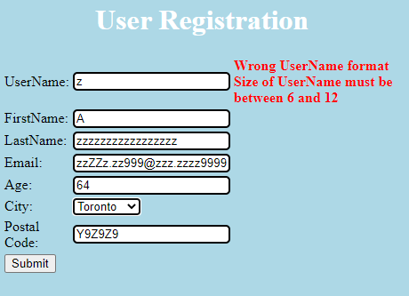

# seg3103_playground

| Outline | Value |
| --- | --- |
| Cours | SEG 3503 |
| Date | Été 2021 |
| professeur | Andrew Forward, aforward@uottawa.ca |
| TA | Aymen Mhamdi, amham077@uottawa.ca |
| Équipe | Alex DeGrace (300071786) et Thomas Ouellette (300081063) |

# Exercise 1

| Cas de Test | Résultats Escomprés | Résultats Actuels | Verdict (Succès, Échec, Non-concluant) |
| --- | --- | --- | --- |
| 1 | demande d'inscription acceptée | demande d'inscription acceptée | Succès |
| 2 | demande d'inscription acceptée | demande d'inscription acceptée | Succès |
| 3 | demande d'inscription acceptée | Wrong FirstName format / Wrong LastName format | Échec |
| 4 | demande d'inscription acceptée | demande d'inscription acceptée | Succès |
| 5 | Err1 | Wrong UserName format / Size of UserName must be between 6 and 12 | Succès |
| 6 | Err1 | Size of UserName must be between 6 and 12 / Wrong UserName format | Succès |
| 7 | Err1 | Size of UserName must be between 6 and 12 / Wrong FirstName format/Wrong LastName format | Succès |
| 8 | Err1 | Wrong UserName format | Succès | 

##### Cas de Test 1

##### Cas de Test 2

##### Cas de Test 3

##### Cas de Test 4

##### Cas de Test 5

##### Cas de Test 6

##### Cas de Test 7

##### Cas de Test 8

# Exercice 2

Étapes pour compiler notre code

javac -encoding UTF-8 -sourcepath src -d dist src/.java

javac -encoding UTF-8 -sourcepath test -d dist -cp dist;lib/junit-platform-console-standalone-1.7.1.jar test/.java

java -jar lib/junit-platform-console-standalone-1.7.1.jar --class-path dist --scan-class-path
