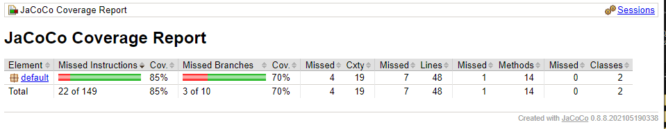
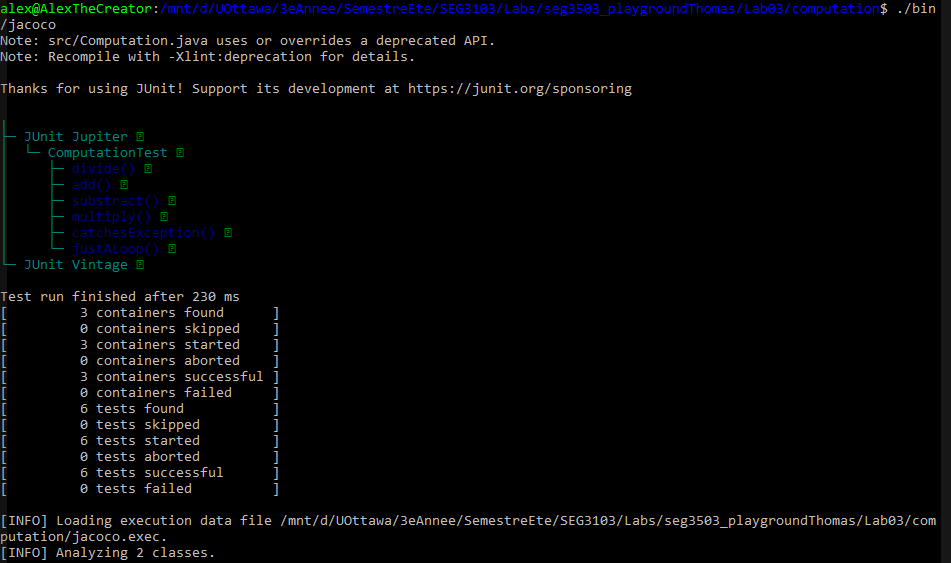
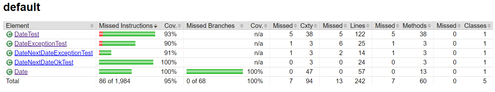
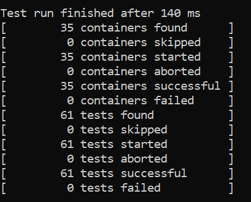
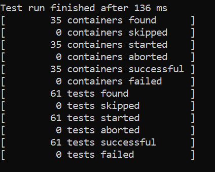

# seg3103_playground Lab 3

| Outline | Value |
| --- | --- |
| Cours | SEG 3503 |
| Date | Été 2021 |
| professeur | Andrew Forward, aforward@uottawa.ca |
| TA | Aymen Mhamdi, amham077@uottawa.ca |
| Équipe | Alex DeGrace (300071786) et Thomas Ouellette (300081063) |

# Computation

Below is the proof that we ran computation Jacoco

# Date

## Coverage

We were able to get a coverage of 100% in Date.java after refactoring the code to remove a condition that was impossible to meet. This condition was when the day was 29 and it was not a leap year since we can't create such a date.

## Is it possible to get 100% coverage of Date.java with only adding 1 test?

No, it is not. Some coverage missing in different functions which can't be all called in a single test. There is also some coverage that is missing. The coverage is mutually exclusive in some condition which means that one test cannot cover both.

## Refactoring

### Refactor 1

This refactor did not affect the code at all.

### Refactor 2

Refactor 2 was undone since it made some of the tests failed.

## Refactor 3

This helped us obtain the coverage of 100% without making any test fail. We could not hit 100% coverage since it was impossible for a date to have the day be 29 and also not being a leap year. Since we check for a leap year if statement above, it was not necessary here.

