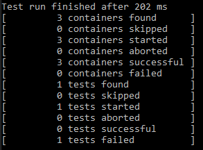
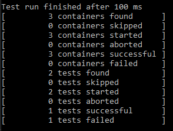
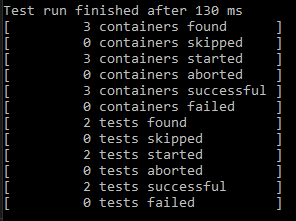
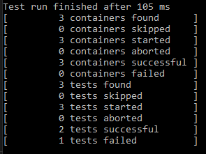
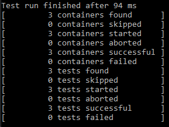
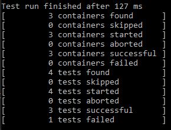
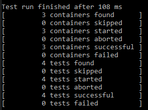
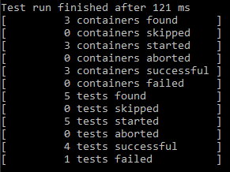
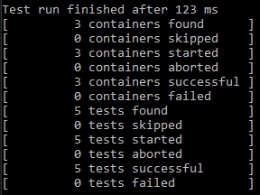

# seg3103_playground

| Outline | Value |
| --- | --- |
| Cours | SEG 3503 |
| Date | Été 2021 |
| professeur | Andrew Forward, aforward@uottawa.ca |
| TA | Aymen Mhamdi, amham077@uottawa.ca |
| Équipe | Alex DeGrace (300071786)|

# Step took for this lab

### Step 0 - Compile and run test

To compile the test file and the fizzbuzz implementation I ran the following commande in WSL Ubuntu from the fizzbuzz_Alex folder:

##### Compile source code

javac -encoding UTF-8 --source-path src -d dist src/*.java

##### Compile test code

javac -encoding UTF-8 --source-path test -d dist -cp dist:lib/junit-platform-console-standalone-1.7.1.jar test/*.java

##### Run test code

java -jar lib/junit-platform-console-standalone-1.7.1.jar --class-path dist --scan-class-path

### Step 1 - Created a Fizzbuzz.java and a FizzbuzzTest.java file

The Fizzbuzz.java file contains a method called get fizzbuzz(int) that take a int and return the correct string using the fizzbuzz game logic. For now no logic had been applied the method only return null. The test file contains no test for the moment. This is the initial commit.

### step 2 - Create tests that failed and fix the implementation to make the test pass

I have done 5 tests overall and 5 changes in the code so that it would pass all tests. I implemented in a test-driven way the programme fizzbuzz using Java.  Here is a screenshot of the tests before each commit in the git hub repository (https://github.com/touel068/seg3503_playground/tree/main/lab04/fizzbuzz_Alex). 

##### Commit 1

##### Commit 2

##### Commit 3

##### Commit 4

##### Commit 5

##### Commit 6

##### Commit 7

##### Commit 8

##### Commit 9

##### Commit 10

Please see the commit message to see which test pass and failed for each commit. I made all the commit to the folder fizzbuzz_Alex while my partner commit changes in tic_java folder.