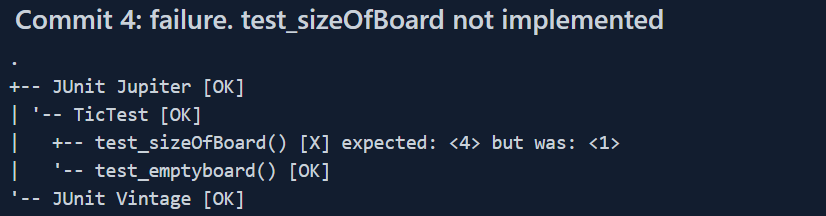

# seg3103_playground

| Outline | Value |
| --- | --- |
| Cours | SEG 3503 |
| Date | Été 2021 |
| professeur | Andrew Forward, aforward@uottawa.ca |
| TA | Aymen Mhamdi, amham077@uottawa.ca |
| Équipe | Thomas Ouellette (300081063)|

# Step took for this lab

### Step 0 - Compile and run test

To compile the test file and the fizzbuzz implementation I ran the following commande in WSL Ubuntu from the fizzbuzz_Alex folder:

##### Compile source code

javac -encoding UTF-8 --source-path src -d dist src/*.java

##### Compile test code

javac -encoding UTF-8 --source-path test -d dist -cp dist:lib/junit-platform-console-standalone-1.7.1.jar test/*.java

##### Run test code

java -jar lib/junit-platform-console-standalone-1.7.1.jar --class-path dist --scan-class-path

### Step 1 - Created a Tic.java and a TicTest.java file

The Tic.java class contains methods to create the board and a method that returns the size of it.

### step 2 - Create tests that failed and fix the implementation to make the test pass

My link: https://github.com/touel068/seg3503_playground/tree/main/lab04/tic_thomas

partners link: https://github.com/touel068/seg3503_playground/tree/main/lab04/fizzbuzz_Alex

Commits for the tests completed:

##### Commit 1

##### Commit 2

##### Commit 3

##### Commit 4

##### Commit 5

##### Commit 6

##### Commit 7

Please see the commit message to see which test pass and failed for each commit. I made all the commit to the folder tic_thomas while my partner commit changes in fizzbuzz_alex folder.