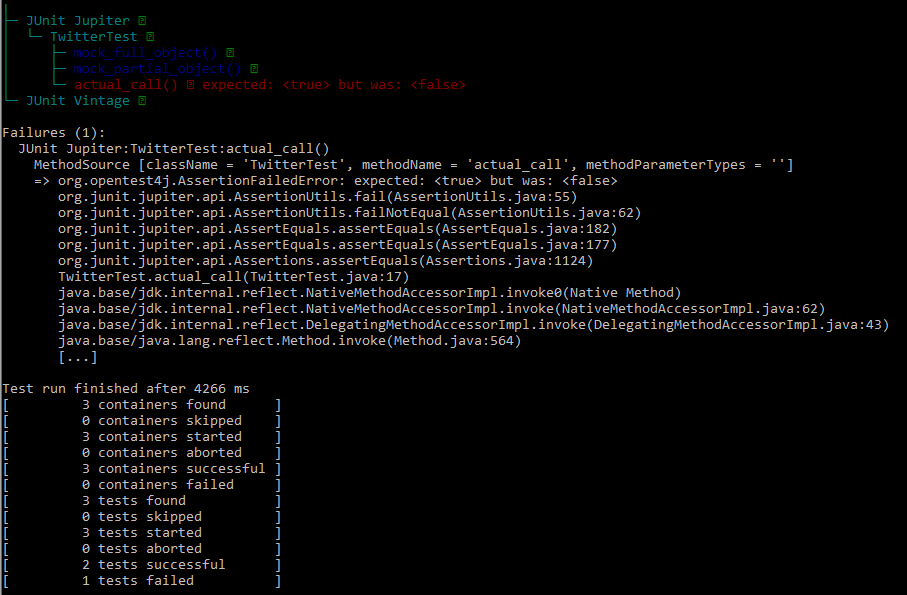
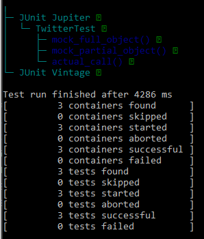
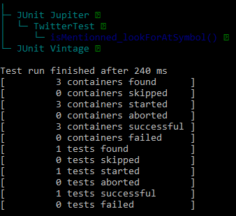
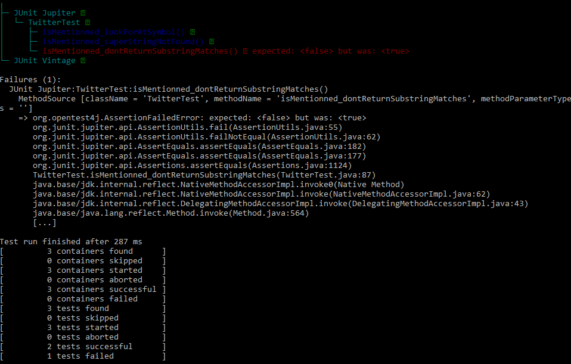
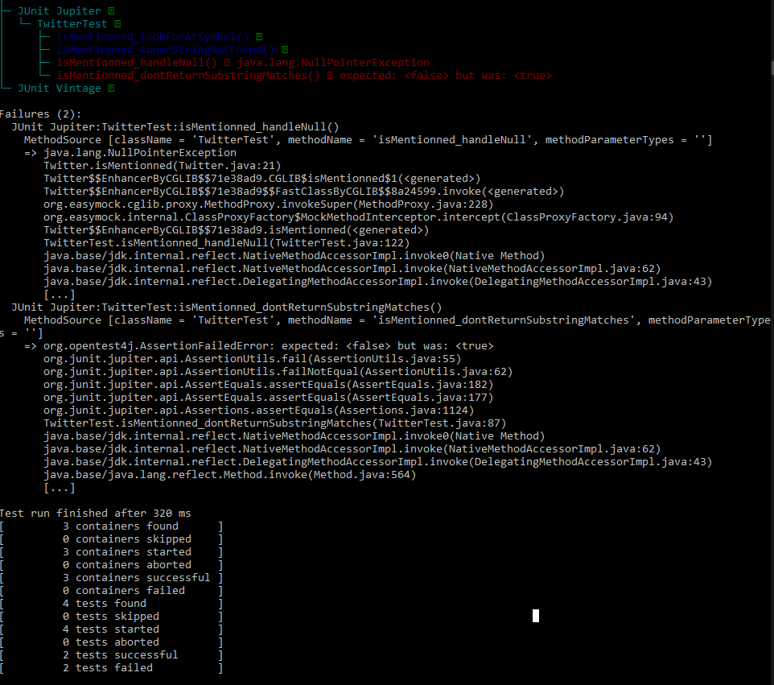
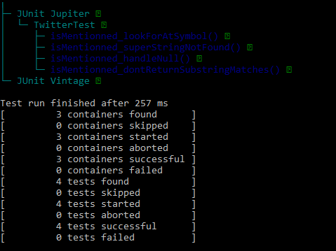

# seg3103_playground Lab 5

| Outline | Value |
| --- | --- |
| Cours | SEG 3503 |
| Date | Été 2021 |
| professeur | Andrew Forward, aforward@uottawa.ca |
| TA | Aymen Mhamdi, amham077@uottawa.ca |
| Équipe | Alex DeGrace (300071786) et Thomas Ouellette (300081063) |

# Part 1 grades
Stubbed code:
 def percentage_grade(marks) do
    :rand.uniform(100)
    end

def letter_grade(marks) do
  list = ["A+","A","A-","B+","B","C+","C","D+","D","E","F"]
  Enum.random(list)
end

def numeric_grade(marks) do
  :rand.uniform(10)
end

Results from putting working code from assignement 2:
[error] GenServer #PID<0.439.0> terminating
** (ArithmeticError) bad argument in arithmetic expression
    :erlang.+("100", 0)
    (elixir) lib/enum.ex:1948: Enum."-sum/1-lists^foldl/2-0-"/2
    (grades) lib/grades.ex:11: Grades.Calculator.avg/1
    (grades) lib/grades.ex:42: Grades.Calculator.letter_grade/1
    (grades) lib/grades_web/live/page_live.ex:23: GradesWeb.PageLive.handle_event/3
    (phoenix_live_view) lib/phoenix_live_view/channel.ex:342: anonymous fn/3 in Phoenix.LiveView.Channel.view_handle_event/3
    (telemetry) /mnt/c/users/thoma/onedrive/documents/github/seg3503_playground/lab05/grades/deps/telemetry/src/telemetry.erl:272: :telemetry.span/3
    (phoenix_live_view) lib/phoenix_live_view/channel.ex:204: Phoenix.LiveView.Channel.handle_info/2
    (stdlib) gen_server.erl:637: :gen_server.try_dispatch/4
    (stdlib) gen_server.erl:711: :gen_server.handle_msg/6
    (stdlib) proc_lib.erl:259: :proc_lib.wake_up/3

 Observations from the stub:
 )

# Part 2 twitter

## Tests inital

Dans cette photo actualTest n'a pas passer car la method est random

Dans cette photo actualTest a pas passer car la method est random

## Twitter lookForAtSymbol

Dans cette photo on voit que le test lookForAtSymbol a passer

## Twitter dontReturnSubstringMarches

Dans cette photo on voit que le test dontReturnSubstringMarches n'a pas passer

## Twitter superStringNotFound

Dans cette photo on voit que le test superStringNotFound a passer

## Twitter handlerNull

Dans cette photo on voit que le test handlerNull n'a pas passer

## Twitter refactor

Dans cette photo on voit que tout les tests ont passer apres le refactor. Le test superStringNotFound ne passait pas puisque la methode isMentionned utilisait contains. Le test handlerNull_Failed ne passait pas puisque la methode isMentionned ne verifiait pas pour un entrer null. 