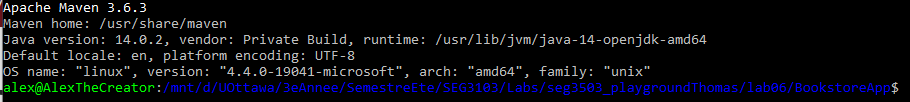
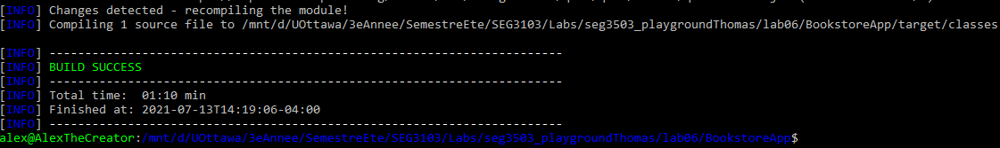
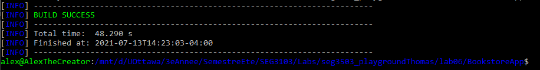
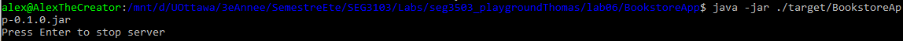
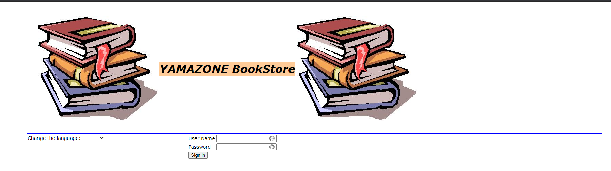
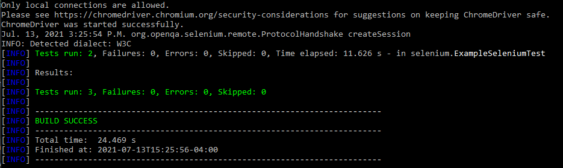
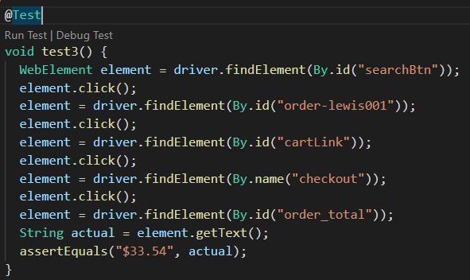
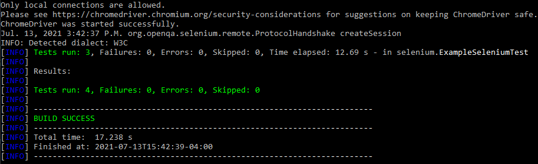

# seg3103_playground Lab 6

| Outline | Value |
| --- | --- |
| Cours | SEG 3503 |
| Date | Été 2021 |
| professeur | Andrew Forward, aforward@uottawa.ca |
| TA | Aymen Mhamdi, amham077@uottawa.ca |
| Équipe | Alex DeGrace (300071786) et Thomas Ouellette (300081063) |

### Output of "mvn --version" to make sure it is installed correctly

### Output of "mvn compile"

### Output of "mvn package -DskipTests" and a brief description of what it does

### Output of "java -jar ./target/BookstoreApp-0.1.0.jar"

### Application running on the browser 

### Output of "mvn test"

### Screenshot of an additional test

### Output of "mvn test" for the new test

