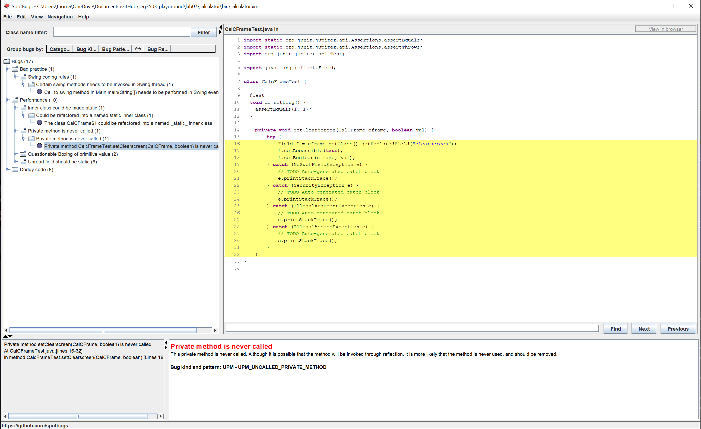

# seg3103_playground Lab 7

| Outline | Value |
| --- | --- |
| Cours | SEG 3503 |
| Date | Été 2021 |
| professeur | Andrew Forward, aforward@uottawa.ca |
| TA | Aymen Mhamdi, amham077@uottawa.ca |
| Équipe | Alex DeGrace (300071786) et Thomas Ouellette (300081063) |

Screenshot of the SpotBug with the 18 original bugs: 

Screenshot of he applications running:  

## Bugs
### 1.Comparison of String parameter using == or != in CalCFrame.clickCheck(String)  

Screenshot of Bug Fix: 

Bug Fix Description: The equals() method should be used
Bug Description: == is used to compare the string s to “”, this is inadequate for string since the == operator checks whether the references to the objects are equal not if the string content is the same

### 2.Call to swing method in Main.main(String[]) needs to be performed in Swing event thread  

Bug Description:The Swing methods setVisible() creates the associated peer for the frame and the event dispatch thread which could be notifying listeners while pack and validate are still processing. This could cause a deadlock.

### 3.The class CalCFrame$1 could be refactored into a named _static_ inner class  

Bug Fix Description: The code should be refactored so the WindowAdapter can be made into a static inner class withing CalCFrame
Bug Description: references made by this inner class may be kept alive longer then necessary

### 4.Private method CalcFrameTest.setClearscreen(CalCFrame, boolean) is never called  

Screenshot of Bug Fix:

Bug Fix Description: Commented out unused code

### 5.Boxing/unboxing to parse a primitive CalCFrame.processNumbers()  

Screenshot of Bug Fix:  

Bug Fix Description: removed .doubleValue();

### 6.Boxing/unboxing to parse a primitive CalCFrame.showAnswer(String)  

Screenshot of Bug Fix:  

Bug Fix Description:removed .doubleValue(); and changed to parseDouble(input)

### 7-12 Unread field: CalCFrame.X; should this field be static? 

Screenshot of Bug Fix:  

Bug Fix Description:field made static

### 13. new CalCFrame(String) uses the same code for two branches  

Screenshot of Bug Fix:  

Bug Fix Description: removed the else if that makes the code redundant

